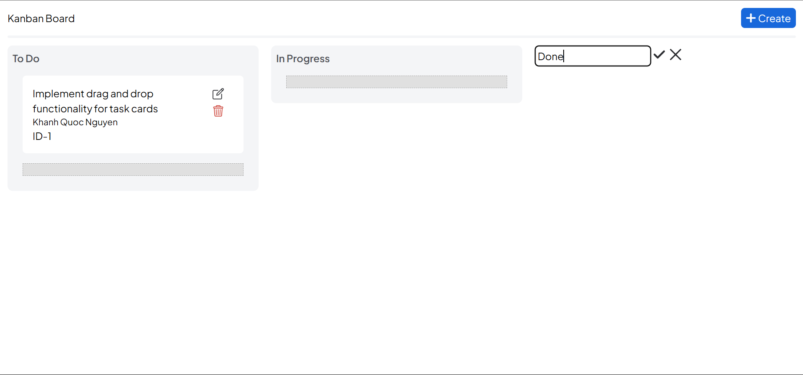

<h1 align='center'>
  Drag and Drop Kanban Board
</h1>

<p align='center'>
A Kanban-style task management board web application where users can intuitively change task status by dragging cards.
</p>

<div align='center'>
    
    
    
    
    
</div>
<br/>

# Setting up and running the application

## Requirements

- Docker

## Run application

1. Change directories into the project source root: `cd Drag_and_Drop_Kanban_Board/src`

2. Run `docker-compose up --build`. This will perform the initial build and then launch your browser to your local site (the first time you do this, it may take a few minutes).

# Folder structure

```
Drag_and_Drop_Kanban_Board/
├─ demo/ (contains demo images)
├─ design/ (contains system design resources)
├─ src/
│  ├─ assignment/ (Source code for Common Assignment)
│  ├─ client/ (Frontend of the Programming Assignment)
│  ├─ server/ (Backend of the Programming Assignment)
├─ .gitignore
├─ README.md
```

# Features

- Status-based columns (e.g., To Do, In Progress, Done)
- Drag and drop functionality for task cards
- Create, edit, and delete task cards and status-based columns
- Real-time data updates when task status changes(Websocket)




# Tech Stack

## Frontend

- React.js
- TypeScript
- State management: Recoil
- UI framework: Tailwind CSS
- Additional libraries and tools can be used as needed
- Websocket

## Backend

- Fastapi
- Database: SQLite
- Additional libraries and tools can be used as needed
- Websocket
